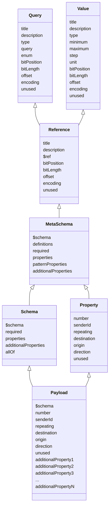

# <a id="title"></a> EnOcean Alliance

EnOcean Equipment Profiles (EEP) JSON Schema Specification

## <a id="intro"></a> Introduction

This Project contains the JSON meta schema to annotate and validate JSON schema representations of the EEP.
The Project contains a "meta schema" which may be used to create a JSON Schema based on the Key-Value pairs specified in the EEPs.
Developers may create their own schemas, referencing this project, to check for the validity and profiting from the code completion creating these files.
An automated processing of the EEP JSON payload data may be achievable too using these JSON schema representations.

## <a id="gettingStarted"></a> Getting Started

1. Clone the project
1. Open the project folder with your preferred code editor: [Visual Studio Code](https://github.com/Microsoft/vscode)
1. Multiple JSON files will reference the JSON schema draft-07 and may need to be changed when a new draft is released:
<http://json-schema.org/draft-07/schema#>
1. If rules of the schema are broken the rule breaker will be marked.
1. For the first vesion only EnOcean EEP key value pairs are supported, based on the type of EEP you may use the grouping under `Strandard` to add your JSON schema representation.
1. We recomend a test driven development style where you create multiple payload examples and work your way backwards creating the JSON schema representation using the code completion and validation provided by the meta schema.

## <a id="buildTest"></a> Build and Test

To use the schema you will need to reference it from your JSON file via:
`"$schema": "uri_to_project/JsonSchema/EEP/eep-meta-schema.json"`

You will need to use the given folder structure to create your JSON based on the EEP number (More information on this under [Contribute](#contribute)).

To test your created JSON Schema there are two possibilities:

1. Creating a JSON schema file and referencing the project schema will mark every error in your JSON schema with wavy underlines. This will help identify and fix problems manually.
1. You may integrate a JSON schema in to your CI/CD pipeline to automatically test your JSON files and inform you if something needs fixing.

## <a id="contribute"></a> Contribute

There are multiple ways you can contribute to this project:

### Contributing with your own JSON schema

In case you have an EEP enabled device not yet standardized with an EEP number you may want to create a JSON Schema representation specific to your company following these steps:

1. Fork this project to your own project
1. Create a folder with your company name in /EnOcean/Organisation`.
1. For multiple Schemas you may need to create further folders with your identification name/number as the name
1. In the subfolders you may create some example payload JSON files the way you want the payload to look like
1. Now you work backwards creating the JSON schema first
1. Referencing this schema in your payload files
1. Then referencing the EEP JSON meta schema in your JSON schema file
1. You can now use the [Property List](#propertylist), code completion and descriptions of the schema properties to create your base schema
1. Now you need to modify your schema and payload examples until the payload errors are fixed
    * You may create your own property by following the pattern given: start with lowercase and use camel case for better readability
    * If you have conditional properties you may use the "allOf" property
    * Use a white listing method by adding the "additionalProperties" as false and explicitly declaring all possible properties used in your payloads
    * You may start your schema file by referencing the meta schema under `meta-schemas/transport-layers/enocean/eep-meta-schema.json` using the `$schema` property
1. You may use /components` to create some property definitions that you know will be used more than once and reference them in your JSON schemas
1. After creating your JSON schema representaiton you may distribute these schemas on your own OR
1. Request a fork merger with this project, to distribute your work form the EnOcean Alliance

### Creating / Modifiing JSON Meta Schema

Modifying / enhancing an existing meta schema or creating a separate JSON meta schema supporting a different telegram standard (e.g. Bluetooth, ZigBee, etc) you will need to follow these steps:

1. Fork this project to your own project
1. Create a folder with your company name or the name of the technology you want to add support to in `meta-schemas` and `
1. You may base your folder structure on the given folders and supported technologies (e.g. EnOcean)
1. We recommend some kind of test driven development of the meta schema:
    * Create example payload files representing your wanted structure in /NameOfTechnology/Standard/.../SchemaID/`
    * Create and reference a JSON schema for these payload files in the same folder as the payload examples
    * Structure your JSON schema as long as all errors in your payload examples are fixed
    * Create your JSON meta schema as `meta-schemas/transport-layers/name-of-technology/name-of-tech-meta-schema.json` and reference it in all your JSON schemas
    * In your meta schema you will need to reference the current JSON schema draft with `"$schema": "http://json-schema.org/draft/2019-09/schema#"`
    * If you only want to modify a meta schema you can skip the last two points
    * Now you will need to modify the meta schema until it represents the state of your JSON
    * There are two ways you can use to create your meta schema:
        1. Using Hyper Schema: Documentation [here](https://json-schema.org/draft/2019-09/json-schema-hypermedia.html)
        2. Create your meta schema independent of the draft: If the JSON should not be able to use all properties allowed by the draft
1. After you have modified / created the meta schema to your liking you may distribute your version of the project on your own OR
1. You may want to request a fork merger in this project, adapt possible changes requested by the EnOcean Alliance, and distribute your work directly from the EnOcean Alliance project

### Project Structure

``` bash
$
+-- meta-schemas
|   +-- components
|       +-- meta
|           +-- component-meta-schema.json
|       +-- component-schema.json
|   +-- transport-layers
|       +-- enocean
|           +-- eep-meta-schema.json
|       +-- other-radio-protocol
+-- schemas
|   +-- enocean
|       +-- standard
|           +-- 1BS
|           +-- 4BS
|           +-- RPS
|           +-- VLD
|       +-- vendors
|           +-- eltako
```

The project has two main folders:

1. `meta-schemas` which contains the main project file `eep-meta-schema.json` in the `enocean` folder within `transport-layers`. The `eep-meta-schema.json` is used to annotated and validate the files in the `folder.
1. contains two folders in the `enocean` folder you will find the of EEP and some example payload files. In the `components` you will find the most commonly used schema definitions to use in the EEP JSON.

The `vendors` folder will contain JSON for EEP that may not strictly fit into the standard EEP and are unique to the Organizations requesting this JSON representation.

The main file of the project is the `eep-meta-schema.json` to find in the folder `meta-schemas/transport-layers/enocean`. The file references the JSON schema draft 2019-09.

For visibility reasons the developer should use the EEP number as the folder name. The folder will contain a JSON schema and a number of payload examples to test the schema.

If the EEP corresponds to one of the standards of the EnOcean Alliance, the Schema should be placed in its corresponding folder. One of: `1BS`, `4BS`, `RPS` or `VLD`. If the Schema does not correspond to one of the standardized folders you may need to create your own implementation within the folder of your own organization: `schemas/enocean/vendors`.

## JSON Meta Schema Diagram



## <a id="propertylist"></a> Property List

### Meta

| Name                 | Type          | Description                                                                                                                                                                                                                                                                                                                                                                                                             |
| -------------------- | ------------- | ----------------------------------------------------------------------------------------------------------------------------------------------------------------------------------------------------------------------------------------------------------------------------------------------------------------------------------------------------------------------------------------------------------------------- |
| $schema              | string        | URL to used JSON schema draft (e.g. "`http://json-schema.org/draft/2019-09/schema#`").                                                                                                                                                                                                                                                                                                                                  |
| definitions          | object        | For refactoring: you may create properties in definitions which you can reference multiple times within the meta schema itselfe.                                                                                                                                                                                                                                                                                        |
| required             | array[string] | List of properties needed to be used in the JSON meta schema to be allowed                                                                                                                                                                                                                                                                                                                                              |
| additionalProperties | boolean       | This should alwas be set as false as to only allow the specified properties to be use, this includes the patternProperties.                                                                                                                                                                                                                                                                                             |
| properties           | object        | Specifies the properties usable by the JSON schema you can create. See ]().                                                                                                                                                                                                                                                                                                                                             |
| patternProperties    | object        | This property describes a pattern that every additional property has to follow to be allowed in the JSON schema. In this meta schema the pattern is a lowercase name, written in camelcase, numbers are allowed, spaces and special characters are not. This property is used to allow developers to specify unique properties for the EEPs used. See [Pattern Properties](#patternproperties) for further information. |

### MetaSchema/Properties

| Name        | Type   | Description                                                                                                                                                                                                                                                                                                                              |
| ----------- | ------ | ---------------------------------------------------------------------------------------------------------------------------------------------------------------------------------------------------------------------------------------------------------------------------------------------------------------------------------------- |
| number      | object | Annotation on how the "number" property shall be declared in the schema file. Standard JSON schema properties are used. For the EEP the number stands for the ID of Profiles. Following pattern is used: `XX-XX-XX`. The `XX` is a standin for an hexadecimal number from `00` to `FF`. Den zu eintragenden Wert muss ein `string` sein. |
| senderID    | object | To identify the sender of the payload a identification is needed. This identification can vary from device to device. Therefor the property value type is set as `string`, you may use this pattern property to formulate a regular expression to check if the sender identification is written correctly.                               |
| repeating   | object | Annotation of the `repeating` property. The property should have a type of `string`. You may define what values are allowed to be used with the `enum` property. For the EEP the following values are the only ones allowed: `none`, `single` and `multiple`.                                                                            |
| destination | object | Annotation of the `destination` property. The property should have a type of `string`. You may define what values are allowed to be used with the `enum` property. For the EEP the following values are the only ones allowed: `actuator`, `controller`, `gateway`, `sensor` and `device`.                                               |
| origin      | object | Annotation of the `origin` property. The property should have a type of `string`. You may define what values are allowed to be used with the `enum` property. For the EEP the following values are the only ones allowed: `actuator`, `controller`, `gateway`, `sensor` and `device`.                                                    |
| direction   | object | Annotation of the `direction` property. The property should have a type of `string`. You may define what values are allowed to be used with the `enum` property. For the EEP the following values are the only ones allowed: `from` and `to`. Is the payload send `from` or `to` the controller?                                         |
| unused      | object | Annotation of the `unused` property. Describing what types are allowed in the `unused` property. For EEP the property can be an object with a single unused range of bits OR an array of objects which contains multiple ranges of unused bits.                                                                                          |

### <a id="patternproperties"></a> MetaSchema/PatternProperties

Reference: possible type of additional properties you may declare in your schema file. Contains a reference to `components`, to expand the properties usable in the payload file.
| Name        | Type   | Description                                                                                                                                                                                                                                     |
| ----------- | ------ | ----------------------------------------------------------------------------------------------------------------------------------------------------------------------------------------------------------------------------------------------- |
| title       | object | Annotation for the title of the `reference` type property. The title must be defined as a `string`.                                                                                                                                             |
| description | object | Annotation for the descriotion of the `reference` type property. The description must be defined as a `string` and holds further information of the property.                                                                                   |
| $ref        | object | The reference describes the $ref property of the JSON schema draft. This will annotated the use of the \$ref requiering to only use files in the `components` Folder.                                                                 |
| bitPosition | object | Annotation for the `bitPosition` property which represents a bit position decribed in an integer. Therfore the annotated object should have a fixed type of `integer`.                                                                          |
| bitLength   | object | Annotation for the `bitlenght` property which represents a bit size decribed in an integer. Therfore the annotated object should have a fixed type of `integer`.                                                                                |
| offset      | object | Annotation for the `offset` property which represents the value that corresponds to the bitwise zero position. The position value is only allowed to be an `integer`.                                                                           |
| encoding    | object | Annotation of the `encoding`property which describes the coding type of the information. It is specified as an `string`. The value must be one of the following: `bigEndian` and `littleEndian`                                                 |
| unused      | object | Annotation of the `unused` property. Describing what types are allowed in the `unused` property. For EEP the property can be an object with a single unused range of bits OR an array of objects which contains multiple ranges of unused bits. |

Query: possible type of additional properties you may declare in your schema file. Represents a Query property to expand the properties usable in the payload file.
| Name        | Type   | Description                                                                                                                                                                                                                                                                       |
| ----------- | ------ | --------------------------------------------------------------------------------------------------------------------------------------------------------------------------------------------------------------------------------------------------------------------------------- |
| title       | object | Annotation for the title of the `query` type property. The title must be defined as a `string`.                                                                                                                                                                                   |
| description | object | Annotation for the descriotion of the `query` type property. The description must be defined as a `string` and holds further information of the property.                                                                                                                         |
| type        | object | Annotation for the `type` property expanding on the JSON schema draft property of the same name. For EEP the type used for the `query` property type should be one of the following `string` values: `object` or `array`.                                                         |
| query       | object | Annotation of the `query` property which represents the usable value depending on which bit position is transmitted. The property should hold a single value and the position or an array of values and positions. Therfore the property shall use a type of `object` or `array`. |
| enum        | object | Annotation of the `enum` property expanding on the JSON schema draft property of the same name. It allowes to specify specific values allowed in the property. For the query the enum should have a type of `integer` representing the bit position of the value.                 |
| bitPosition | object | Annotation for the `bitPosition` property which represents a bit position decribed in an integer. Therfore the annotated object should have a fixed type of `integer`.                                                                                                            |
| bitLength   | object | Annotation for the `bitlenght` property which represents a bit size decribed in an integer. Therfore the annotated object should have a fixed type of `integer`.                                                                                                                  |
| offset      | object | Annotation for the `offset` property which represents the value that corresponds to the bitwise zero position. The position value is only allowed to be an `integer`.                                                                                                             |
| encoding    | object | Annotation of the `encoding`property which describes the coding type of the information. It is specified as an `string`. The value must be one of the following: `bigEndian` and `littleEndian`                                                                                   |
| unused      | object | Annotation of the `unused` property. Describing what types are allowed in the `unused` property. For EEP the property can be an object with a single unused range of bits OR an array of objects which contains multiple ranges of unused bits.                                   |

Value: possible type of additional properties you may declare in your schema file. Represents a Value range to expand the properties usable in the payload file.
| Name        | Type   | Description                                                                                                                                                                                                                                     |
| ----------- | ------ | ----------------------------------------------------------------------------------------------------------------------------------------------------------------------------------------------------------------------------------------------- |
| title       | object | Annotation for the title of the `value` type property. The title must be defined as a `string`.                                                                                                                                                 |
| description | object | Annotation for the descriotion of the `value` type property. The description must be defined as a `string` and holds further information of the property.                                                                                       |
| type        | object | Annotation for the `type` property expanding on the JSON schema draft property of the same name. For EEP the type used for the `value` property type should be one of the following `string` values: `number`.                                  |
| minimum     | object |                                                                                                                                                                                                                                                 |
| maximum     | object |                                                                                                                                                                                                                                                 |
| step        | object |                                                                                                                                                                                                                                                 |
| unit        | object |                                                                                                                                                                                                                                                 |
| bitPosition | object | Annotation for the `bitPosition` property which represents a bit position decribed in an integer. Therfore the annotated object should have a fixed type of `integer`.                                                                          |
| bitLength   | object | Annotation for the `bitlenght` property which represents a bit size decribed in an integer. Therfore the annotated object should have a fixed type of `integer`.                                                                                |
| offset      | object | Annotation for the `offset` property which represents the value that corresponds to the bitwise zero position. The position value is only allowed to be an `integer`.                                                                           |
| encoding    | object | Annotation of the `encoding`property which describes the coding type of the information. It is specified as an `string`. The value must be one of the following: `bigEndian` and `littleEndian`                                                 |
| unused      | object | Annotation of the `unused` property. Describing what types are allowed in the `unused` property. For EEP the property can be an object with a single unused range of bits OR an array of objects which contains multiple ranges of unused bits. |

### <a id="></a>

| Name       | Type          | Description                                                                                                                                                                                                                          |
| ---------- | ------------- | ------------------------------------------------------------------------------------------------------------------------------------------------------------------------------------------------------------------------------------ |
| $schema    | string        | URL to the JSON Meta Schema used (e.g. "`..../meta-schemas/transport-layer/enocean/eep-meta-schema.json`")                                                                                                                                           |
| required   | array[string] | List of properties needed to be used in the JSON schema to be allowed                                                                                                                                                                |
| properties | object        | Properties that are specificaly defined                                                                                                                                                                                              |
| allOf      | array[object] | if / else statements that allow conditional property addition to the base schema. If a payload property has a specific value you may check this within the allOf-if-statement and add or remove the required properties accordingly. |

### <a id="patternproperties"></a> Schema/PatternProperties

Reference
| Name        | Type                  | Description                                                                                                                                                                                                                                                                                              |
| ----------- | --------------------- | -------------------------------------------------------------------------------------------------------------------------------------------------------------------------------------------------------------------------------------------------------------------------------------------------------- |
| title       | string                | Informative name for the property.                                                                                                                                                                                                                                                                       |
| description | string                | Description on what the property represents and/or what it is used for.                                                                                                                                                                                                                                  |
| $ref        | string                | URL to the definition, usualy begins with the path to the `components`, the JSON file that contains the definition and ends with the defined property name if multiple properties are defined in the file (i.e. `"../../../../components/my-definitions#/definitions/my-property#"`).      |
| bitPosition | integer               | Integer value that describes the postion of the decribed property in the data block of the EEP as described in the key-value-pairs of the profile.                                                                                                                                                       |
| bitLength   | integer               | Integer value that decribes the bit size of the property in the data block, described in the EEP key-value-pairs.                                                                                                                                                                                        |
| offset      | integer               | Integer value that represents the bit position of the bitwise zero.                                                                                                                                                                                                                                      |
| encoding    | string                | String value that describes which encoding should be used. Only the values `bigEndian` and `littleEndian` are allowed.                                                                                                                                                                                   |
| unused      | object, array[object] | Object or an array of objects naming all unused bits of the property. The objects contain further properties: `from` and `to` representing the range of bits that are marked as unused, unset  or reserved. The bits in this range may have any value but do not have any meaning in context of the EEP. |

Query
| Name        | Type                  | Description                                                                                                                                                                                                                                                                                                                                                                                                                        |
| ----------- | --------------------- | ---------------------------------------------------------------------------------------------------------------------------------------------------------------------------------------------------------------------------------------------------------------------------------------------------------------------------------------------------------------------------------------------------------------------------------- |
| title       | string                | Informative name for the property.                                                                                                                                                                                                                                                                                                                                                                                                 |
| description | string                | Description on what the property represents and/or what it is used for.                                                                                                                                                                                                                                                                                                                                                            |
| type        | string                | String value describing which type of value the property should hold, any other value type will be marked as an error. For the query type property the allowed types are: `"object"` and `"array"`.                                                                                                                                                                                                                                |
| query       | object, array[object] | Object or array of objects that contains multiple values represented as integer values. You may have multiple string values that contain an abstract `value` like `"relative"` or `"absolut"` and connect them to integer values represented by `position`. A single object is used when only one such value must be set. Multiple object need to be set in an array where the `position` value within the objects must be unique. |
| enum        | array[integer]        | An array filled with all possible integer values usable in the property. The values represent the `position` properties in the `query`.                                                                                                                                                                                                                                                                                            |
| bitPosition | integer               | Integer value that describes the postion of the decribed property in the data block of the EEP as described in the key-value-pairs of the profile.                                                                                                                                                                                                                                                                                 |
| bitLength   | integer               | Integer value that decribes the bit size of the property in the data block, described in the EEP key-value-pairs.                                                                                                                                                                                                                                                                                                                  |
| offset      | integer               | Integer value that represents the bit position of the bitwise zero.                                                                                                                                                                                                                                                                                                                                                                |
| encoding    | string                | String value that describes which encoding should be used. Only the values `bigEndian` and `littleEndian` are allowed.                                                                                                                                                                                                                                                                                                             |
| unused      | object, array[object] | Object or an array of objects naming all unused bits of the property. The objects contain further properties: `from` and `to` representing the range of bits that are marked as unused, unset  or reserved. The bits in this range may have any value but do not have any meaning in context of the EEP.                                                                                                                           |

Value
| Name        | Type                  | Description                                                                                                                                                                                                                                                                                              |
| ----------- | --------------------- | -------------------------------------------------------------------------------------------------------------------------------------------------------------------------------------------------------------------------------------------------------------------------------------------------------- |
| title       | string                | Informative name for the property.                                                                                                                                                                                                                                                                       |
| description | string                | Description on what the property represents and/or what it is used for.                                                                                                                                                                                                                                  |
| type        | string                | String value describing which type of value the property should hold, any other value type will be marked as an error. For the value type property the allowed types are: `"number"`.                                                                                                                    |
| minimum     | number                | A number value representing the minimal value allowed to set the property to.                                                                                                                                                                                                                            |
| maximum     | number                | A number value representing the maximal value allowed to set the property to.                                                                                                                                                                                                                            |
| step        | number                | A number value representing the step size allowed between the values allowed to set the property to.                                                                                                                                                                                                     |
| unit        | string                | String value for the unit the value represents. the `unit` property must always have fixed values set by the schema or the definition reference depending on what the property represents (i.e. for a temperature the unit may be `°C`, `°F` or `K`; any other value or even only one of these).         |
| bitPosition | integer               | Integer value that describes the postion of the decribed property in the data block of the EEP as described in the key-value-pairs of the profile.                                                                                                                                                       |
| bitLength   | integer               | Integer value that decribes the bit size of the property in the data block, described in the EEP key-value-pairs.                                                                                                                                                                                        |
| offset      | integer               | Integer value that represents the bit position of the bitwise zero.                                                                                                                                                                                                                                      |
| encoding    | string                | String value that describes which encoding should be used. Only the values `bigEndian` and `littleEndian` are allowed.                                                                                                                                                                                   |
| unused      | object, array[object] | Object or an array of objects naming all unused bits of the property. The objects contain further properties: `from` and `to` representing the range of bits that are marked as unused, unset  or reserved. The bits in this range may have any value but do not have any meaning in context of the EEP. |

### <a id="payload"></a> Payload

| Name         | Type                  | Description                                                                                                                                                                                                                                                                     |
| ------------ | --------------------- | ------------------------------------------------------------------------------------------------------------------------------------------------------------------------------------------------------------------------------------------------------------------------------- |
| $schema      | string                | URL that must be given in the payload files referencing this JSON schema                                                                                                                                                                                                        |
| number       | string                | Property used to specify the EEP identification named "number". The number has a pattern: XX-XX-XX with XX a standin for a hexadecimal number                                                                                                                                   |
| senderId     | string                | Identification of the sender device. These can vary a lot, therefor no pattern is set                                                                                                                                                                                           |
| repeating    | string                | What repetition modus is used during transmission. You can select between: "none", "single" and "multiple"                                                                                                                                                                      |
| destination  | string                | Describes the destination of the transmission since EEPs may be send in both directions, from the device to the controller or to the device from the controller. The following destinations are allowed for the EEP: "actuator", "controller", "gateway", "sensor" and "device" |
| origin       | string                | Describes the origin of the transmission since EEPs may be send in both directions, from the device to the controller or to the device from the controller. The following origins are allowed for the EEP: "actuator", "controller", "gateway", "sensor" and "device"           |
| direction    | string                | Describes the direction the transmision is send based on the device, so if the EEP is send "from" the controller or if it is send "to" the controller. Possible values are therefor "from" and "to"                                                                             |
| unused       | object, array[object] | Property to specify the unused bits in the data block. This may contain two properties "from" and "to" or an array of numerous "from" and "to" to describe every unused bit                                                                                                     |
| yourProperty | object                | none, or as many addition properties defined by the schema in "properties" and anotated by the meta schemas own "patternProperties".                                                                                                                                            |
